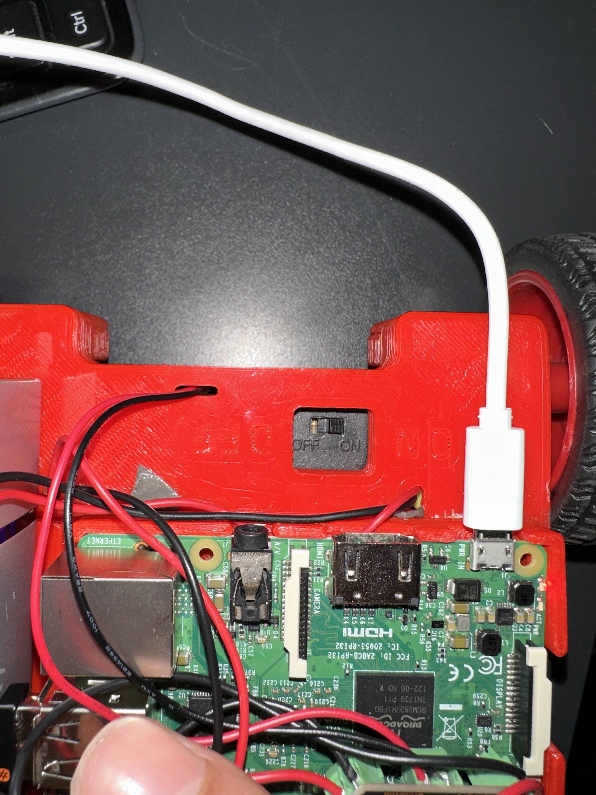
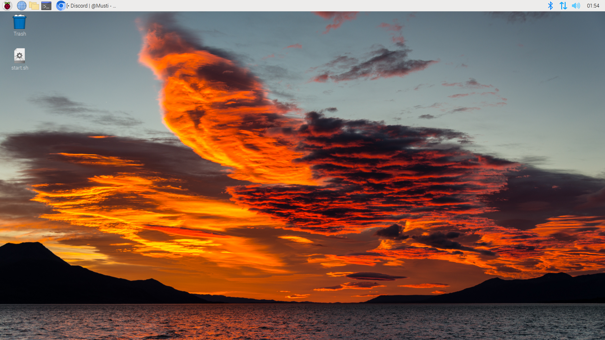
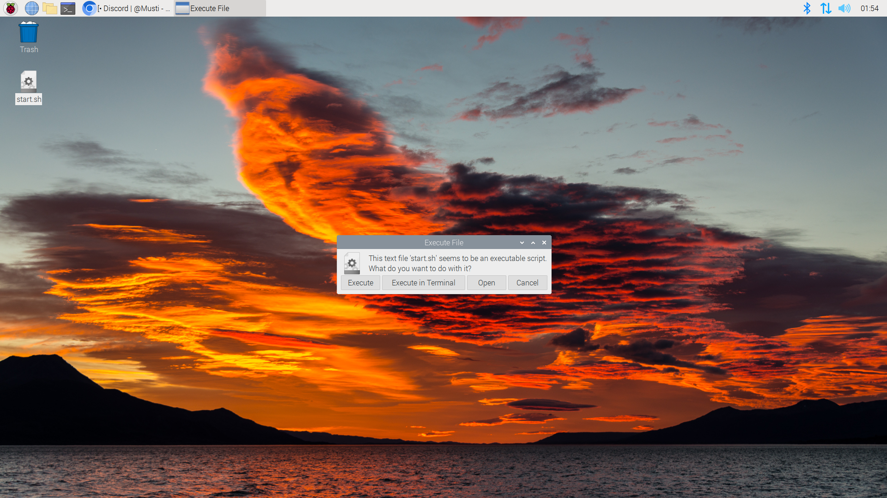
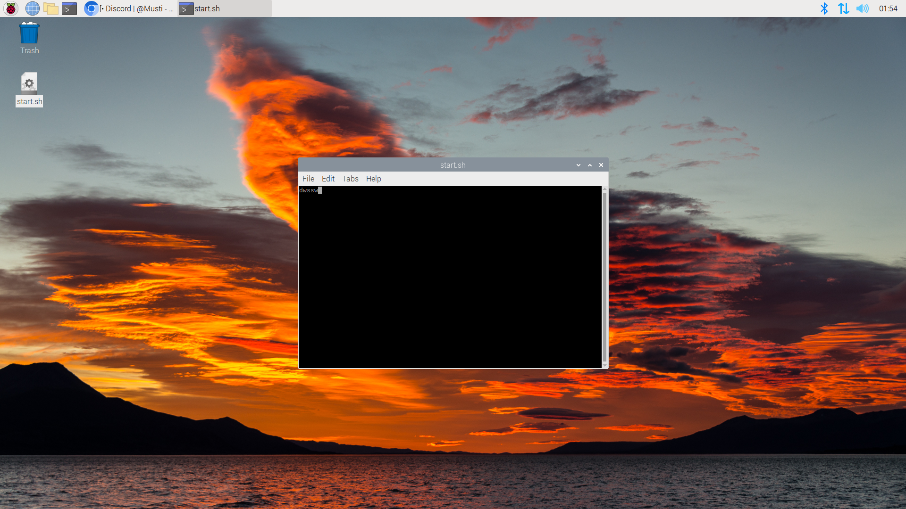

# Robotbil Startguide

Denne guide viser, hvordan du starter din robotbil op og styrer den med tastaturet.

## Trin 1: Tænd for motoren

Find den røde bil eller den grøn bil, som vist på billedet nedenfor. Sørg for at tænde motoren ved at skubbe knappen til "ON"-positionen.

## Trin 2: Start robotten via script

### 1. Find `start.sh` filen

På skrivebordet vil du se en fil med navnet `start.sh`. Dobbeltklik på denne fil.

### 2. Vælg "Execute in Terminal"

Efter du har dobbeltklikket på `start.sh`, vil der dukke en boks op, hvor du skal vælge "Execute in Terminal".

### 3. Terminalen åbnes

Når terminalen åbnes, er din robotbil klar til at blive styret.

## Trin 3: Styring af robotbilen

Når scriptet kører, kan du styre robotbilen ved at bruge følgende taster på dit tastatur:

- `W` for at køre fremad.
- `A` for at dreje til venstre.
- `S` for at bakke.
- `D` for at dreje til højre.

